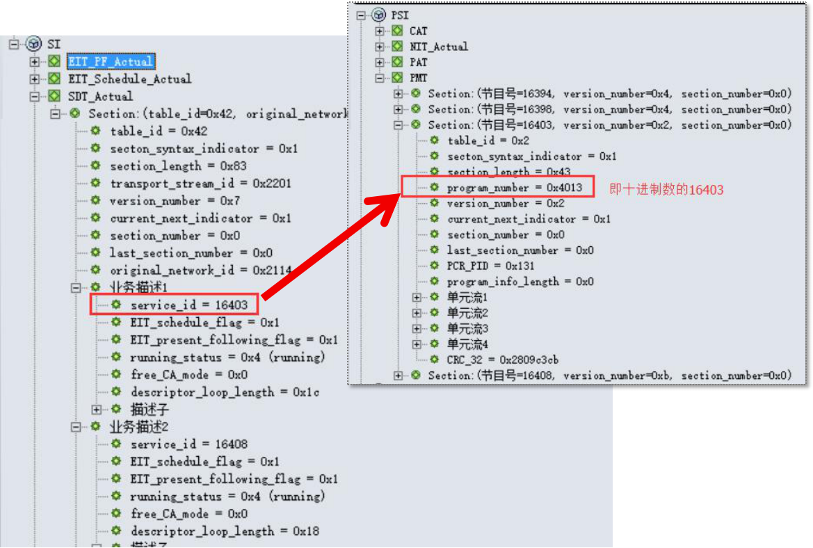
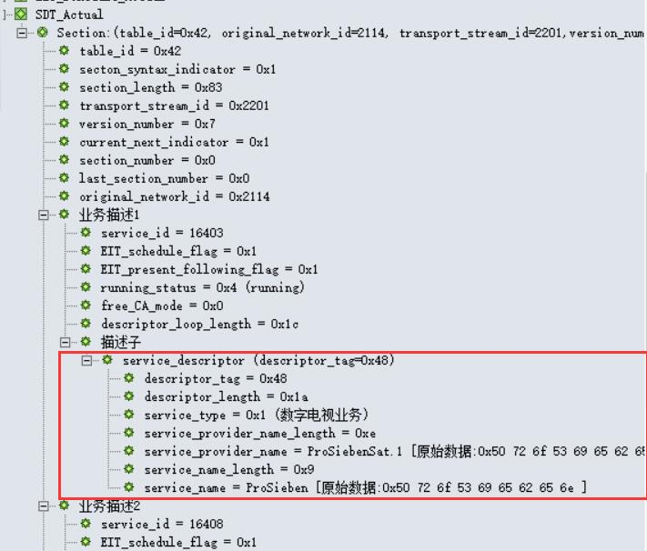
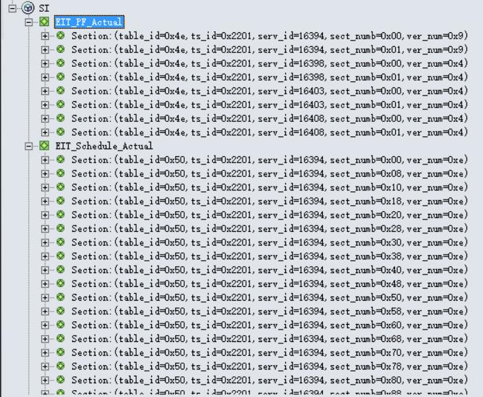
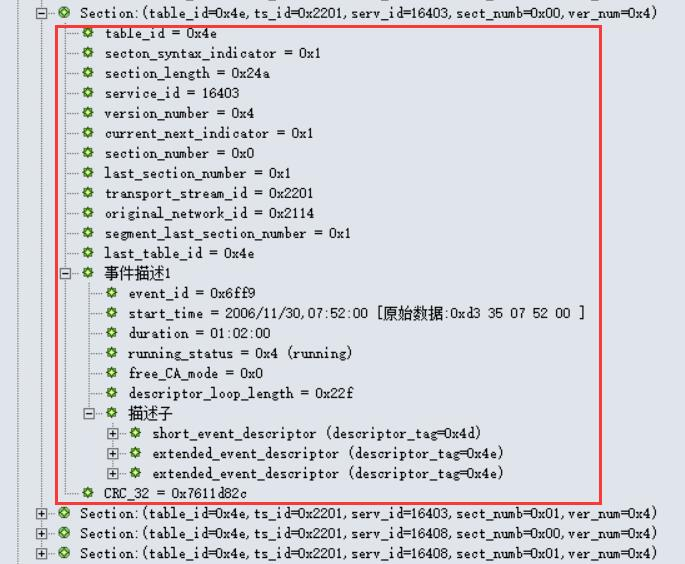
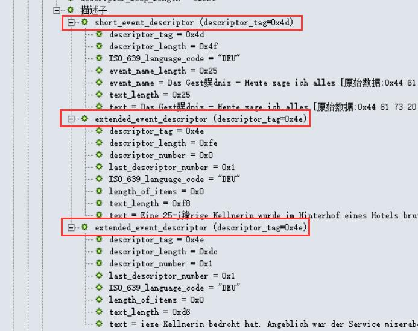
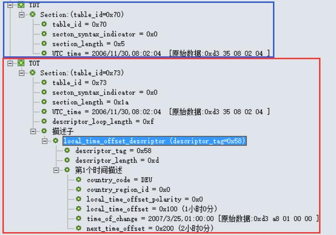
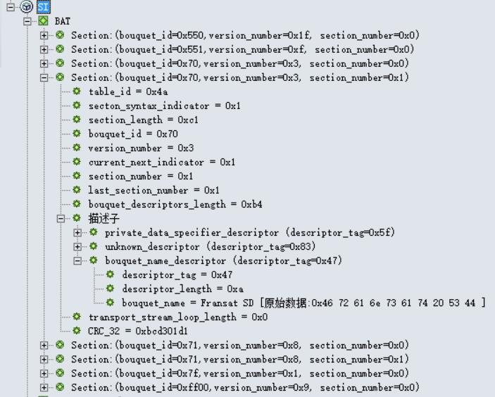
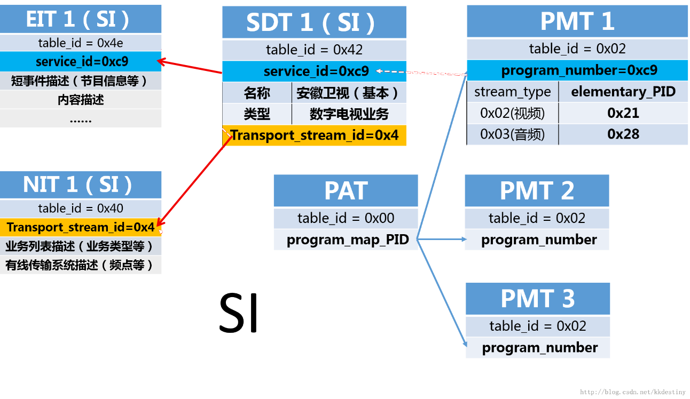

# 第四章：深入学习SI

    “SI是对多个TS流的描述，它拓展和完善了PSI提供的信息。”
    ---- 可以理解为，PSI是某一频点里的节目引导信息

PSI只提供了单个TS流的信息，使接收机能够对单个TS流中的不同节目进行解码； 但是，它不能提供多个TS流的相关业务，也不能提供节目的类型、节目名称、开始时间、节目简介等信息。 因此，DVB对PSI进行了扩展，提供了其他不同类型的表，形成了SI。

SI定义的表，并不需要全部传输， 其中，SDT、EIT和TDT是必须传输的； 而又以SDT和EIT最为重要，利用这2个表可以构成功能不同的EPG， 如提供节目附加信息、节目分类、节目预定和家长分级控制等。

## SDT表

    "SDT描述了业务内容及信息，连接了NIT、EIT和PMT（PSI）"
    这里所说的业务，即Service；CCTV 1是一个Service(我们说“频道”)，湖南卫视也是一个Service

SDT表被切分成业务描述段（service_description_section），由PID为0x0011的TS包传输（BAT段也由PID为0x0011的TS包传输，但table_id不同）。

描述现行TS（即包含SDT表的TS）的SDT表的任何段的table_id都为0x42，且具有相同的table_id_extension（transport_stream_id）以及相同的original_network_id。 指向非现行TS的SDT表的任何段的table_id都应取0x46。

### SDT表的结构分析

SDT表主要提供关于Service的信息，如Service name，Service provider 等。

    PID = 0x0011
    table_id = 0x42 (discribe actual TS,现行TS)
    table_id = 0x46 (discribe not actual TS,非现行TS)

下表是SDT结构：

<table class="table table-condensed table-hover" style="margin-top:-5px; font-size:70%; text-align:center;">
	<thead>
		<tr style="background-color:#bbb; color:#000; font-weight:bold;"><td>Syntax(句法结构)</td><td>No. of bits(所占位数)</td><td>Identifier(识别符)</td><td>Note(注释)</td></tr>
	</thead>
	<tbody><tr style="text-align:left; font-weight:bold;"><td colspan="4">service_description_section(){</td></tr>
	<tr><td style="text-indent:4em; text-align:left;">table_id</td><td>8</td><td>uimsbf</td><td>表标识符</td></tr>
	<tr><td style="text-indent:4em; text-align:left;">Section_syntax_indicator</td><td>1</td><td>bslbf</td><td>段语法指示符，通常设置为“1”</td></tr>
	<tr><td style="text-indent:4em; text-align:left;">Reserved_future_use</td><td>1</td><td>bslbf</td><td class="light-text">预留使用</td></tr>
	<tr><td style="text-indent:4em; text-align:left;">Reserved</td><td>2</td><td>bslbf</td><td class="light-text">保留</td></tr>
	<tr><td style="text-indent:4em; text-align:left;">Section_length</td><td>12</td><td>uimsbf</td><td><a data-content="&lt;h3 class=&quot;pop-title&quot;&gt;Section_length&lt;/h3&gt;&lt;p class=&quot;pop-text&quot;&gt;段长度，12位，指出了此Section的长度，头两位为“00”，值不超过1021&lt;/p&gt;" style="cursor:pointer;" data-toggle="popover" data-placement="left" data-trigger="click" data-html="true" data-original-title="" title="">注释</a></td></tr>
	<tr><td style="text-indent:4em; text-align:left;">transport_stream_id</td><td>16</td><td>uimsbf</td><td>传输流标识符，给出TS的识别号</td></tr>
	<tr><td style="text-indent:4em; text-align:left;">Reserved</td><td>2</td><td>bslbf</td><td class="light-text">保留</td></tr>
	<tr><td style="text-indent:4em; text-align:left;">Version_number</td><td>5</td><td>bslbf</td><td><a data-content="&lt;h3 class=&quot;pop-title&quot;&gt;Version_number&lt;/h3&gt;&lt;p class=&quot;pop-text&quot;&gt;sub_table的版本号，值为0~31，当sub_table信息改变时，值加1，若值已为31，则变化后值为0（循环），若curren_next_indicator的值为“1”，version_number指当前sub_table,若curren_next_indicator的值为“0”，version_number指下一个sub_table&lt;/p&gt;" style="cursor:pointer;" data-toggle="popover" data-placement="left" data-trigger="click" data-html="true" data-original-title="" title="">注释</a></td></tr>
	<tr><td style="text-indent:4em; text-align:left;">Current_next_indicator</td><td>1</td><td>bslbf</td><td><a data-content="&lt;h3 class=&quot;pop-title&quot;&gt;Current_next_indicator&lt;/h3&gt;&lt;p class=&quot;pop-text&quot;&gt;当前后续指示符，1位，“1”指sub_table是current, “0”指sub_table是next&lt;/p&gt;" style="cursor:pointer;" data-toggle="popover" data-placement="left" data-trigger="click" data-html="true" data-original-title="" title="">注释</a></td></tr>
	<tr><td style="text-indent:4em; text-align:left;">Section_number</td><td>8</td><td>uimsbf</td><td><a data-content="&lt;h3 class=&quot;pop-title&quot;&gt;Section_number&lt;/h3&gt;&lt;p class=&quot;pop-text&quot;&gt;段号，8位,给出section号，在sub_table中，第一个section其section_number为&quot;0x00&quot;，每增加一个section，section_number加一&lt;/p&gt;" style="cursor:pointer;" data-toggle="popover" data-placement="left" data-trigger="click" data-html="true" data-original-title="" title="">注释</a></td></tr>
	<tr><td style="text-indent:4em; text-align:left;">last_section_number</td><td>8</td><td>uimsbf</td><td><a data-content="&lt;h3 class=&quot;pop-title&quot;&gt;last_section_number&lt;/h3&gt;&lt;p class=&quot;pop-text&quot;&gt;最后段号，sub_table中最后一个section的section_number&lt;/p&gt;" style="cursor:pointer;" data-toggle="popover" data-placement="left" data-trigger="click" data-html="true" data-original-title="" title="">注释</a></td></tr>
	<tr><td style="text-indent:4em; text-align:left;">original_nerwork_id</td><td>16</td><td>uimsbf</td><td><a data-content="&lt;h3 class=&quot;pop-title&quot;&gt;original_nerwork_id&lt;/h3&gt;&lt;p class=&quot;pop-text&quot;&gt;原始网络标识符,16位，给出originating delivery system中的网络识别号&lt;/p&gt;" style="cursor:pointer;" data-toggle="popover" data-placement="left" data-trigger="click" data-html="true" data-original-title="" title="">注释</a></td></tr>
	<tr><td style="text-indent:4em; text-align:left;">reserved_future_use</td><td>8</td><td>bslbf</td><td class="light-text">预留使用</td></tr>
	<tr style="text-align:left;"><td colspan="4" style="text-indent:4em; text-align:left;">for(i=0;i&lt;N;i++){</td></tr>
	<tr><td style="text-indent:6em; text-align:left;">service_id</td><td>16</td><td>uimsbf</td><td><a data-content="&lt;h3 class=&quot;pop-title&quot;&gt;service_id&lt;/h3&gt;&lt;p class=&quot;pop-text&quot;&gt;业务标识符，16位，用来标识TS中的Service，等同于program_map_section中的program_number&lt;/p&gt;" style="cursor:pointer;" data-toggle="popover" data-placement="left" data-trigger="click" data-html="true" data-original-title="" title="">注释</a></td></tr>
	<tr><td style="text-indent:6em; text-align:left;">reserved_future_use</td><td>8</td><td>bslbf</td><td class="light-text">预留使用</td></tr>
	<tr><td style="text-indent:6em; text-align:left;">EIT_schedule_flag</td><td>1</td><td>bslbf</td><td><a data-content="&lt;h3 class=&quot;pop-title&quot;&gt;EIT_schedule_flag&lt;/h3&gt;&lt;p class=&quot;pop-text&quot;&gt;EIT时间表标志，1位，若为“1”，则EIT schedule信息在当前TS中，为“0”，则TS中不存在EIT schedule信息&lt;/p&gt;" style="cursor:pointer;" data-toggle="popover" data-placement="left" data-trigger="click" data-html="true" data-original-title="" title="">注释</a></td></tr>
	<tr><td style="text-indent:6em; text-align:left;">EIT_present_following_flag</td><td>1</td><td>bslbf</td><td><a data-content="&lt;h3 class=&quot;pop-title&quot;&gt;EIT_present_following_flag&lt;/h3&gt;&lt;p class=&quot;pop-text&quot;&gt;EIT当前后续标志，1位，若为“1”，则EIT_present_following 信息在当前TS中，为“0”，则TS中不存在EIT_present_following信息。&lt;/p&gt;" style="cursor:pointer;" data-toggle="popover" data-placement="left" data-trigger="click" data-html="true" data-original-title="" title="">注释</a></td></tr>
	<tr><td style="text-indent:6em; text-align:left;">running_status</td><td>3</td><td>uimsbf</td><td><a data-content="&lt;h3 class=&quot;pop-title&quot;&gt;running_status&lt;/h3&gt;&lt;p class=&quot;pop-text&quot;&gt;运行状态，3位，表示service的状态&lt;table class=&quot;table table-condensed table-hover&quot; style=&quot;width:500px; font-family:Microsoft Yahei; font-size:70%; text-align:center;&quot;&gt;&lt;thead&gt;&lt;tr style=&quot;background:#bbb; color:#000;&quot;&gt;&lt;td&gt;值&lt;/td&gt;&lt;td&gt;含义&lt;/td&gt;&lt;/tr&gt;&lt;/thead&gt;&lt;tr&gt;&lt;td&gt;0&lt;/td&gt;&lt;td&gt;未定义&lt;/td&gt;&lt;/tr&gt;&lt;tr&gt;&lt;td&gt;1&lt;/td&gt;&lt;td&gt;未运行&lt;/td&gt;&lt;/tr&gt;&lt;tr&gt;&lt;td&gt;2&lt;/td&gt;&lt;td&gt;几秒后开始（如录像）&lt;/td&gt;&lt;/tr&gt;&lt;tr&gt;&lt;td&gt;3&lt;/td&gt;&lt;td&gt;暂停&lt;/td&gt;&lt;/tr&gt;&lt;tr&gt;&lt;td&gt;4&lt;/td&gt;&lt;td&gt;运行&lt;/td&gt;&lt;/tr&gt;&lt;tr&gt;&lt;td&gt;5 - 7&lt;/td&gt;&lt;td&gt;预留使用&lt;/td&gt;&lt;/tr&gt;&lt;/table&gt;&lt;/p&gt;" style="cursor:pointer;" data-toggle="popover" data-placement="left" data-trigger="click" data-html="true" data-original-title="" title="">注释</a></td></tr>
	<tr><td style="text-indent:6em; text-align:left;">freed_CA_mode</td><td>1</td><td>bslbf</td><td><a data-content="&lt;h3 class=&quot;pop-title&quot;&gt;freed_CA_mode&lt;/h3&gt;&lt;p class=&quot;pop-text&quot;&gt;自由条件接收模式，1位，“0”表示无CA，“1”表示有CA&lt;/p&gt;" style="cursor:pointer;" data-toggle="popover" data-placement="left" data-trigger="click" data-html="true" data-original-title="" title="">注释</a></td></tr>
	<tr><td style="text-indent:6em; text-align:left;">descriptors_loop_length</td><td>12</td><td>uimsbf</td><td>描述符循环长度</td></tr>
	<tr style="text-align:left;"><td colspan="4" style="text-indent:6em; text-align:left;">for(i=0;i&lt;N;i++){</td></tr>
	<tr style="text-align:left;"><td colspan="3" style="text-indent:8em; text-align:left; font-weight:bold;">descriptor()</td><td></td></tr>
	<tr style="text-align:left;"><td colspan="4" style="text-indent:6em; text-align:left;">}</td></tr>
	<tr style="text-align:left;"><td colspan="4" style="text-indent:4em; text-align:left;">}</td></tr>
	<tr><td style="text-indent:4em; text-align:left;">CRC_32</td><td>32</td><td>rpchof</td><td><a data-content="&lt;h3 class=&quot;pop-title&quot;&gt;CRC_32&lt;/h3&gt;&lt;p class=&quot;pop-text&quot;&gt;32位, 表示CRC的值&lt;/p&gt;" style="cursor:pointer;" data-toggle="popover" data-placement="left" data-trigger="click" data-html="true" data-original-title="" title="">注释</a></td></tr>
	<tr style="text-align:left;"><td colspan="4" style="text-align:left;">}</td></tr>
</tbody></table>

SDT 表中的Descriptor()：

    Bouquet name descriptor：查看！！
    CA identifier descriptor：查看！！
    Country availability descriptor：查看！！
    Data broadcast descriptor：查看！！
    Linkage descriptor：查看！！
    Mosaic descriptor：查看！！
    Multilingual service descriptor：查看！！
    NVOD reference descriptor：查看！！
    Service descriptor：查看！！
    Telephone descriptor：查看！！
    Time shifted service descriptor：查看！！

### SDT表实例

在下图中，我们可以看到SDT表中的service_id=16403与PMT表中的program_number=0x4013(即16403)是对应的。 也就是说，通过解析SDT表获取到service_id=16403的节目信息后，可以存储到program_number=0x4013(即16403)的节目信息中。

在下图中，我们可以看到SDT表的基本信息。

## EIT表

    "EIT按时间顺序提供每一个业务所包含的事件信息"
    --- 这里所说的事件，即Event；《新闻联播》是一个事件，《焦点访谈》也是一个事件。
    --- 举个例子来说，EIT表就是提供了中央一台(CCCT 1)各个时间段的节目列表的

EIT即事件信息表（Event Information Table），它是EPG中绝大部分信息的携带者。 事实上，EPG主要就是通过SDT和EIT信息的获取和重组实现的。 SDT只提供了频道信息，而EIT则提供各频道下的所有节目的信息。 EIT的主要信息也是通过插入的描述符来实现的。 EIT按照时间顺序提供每一个业务所包含的事件的相关信息（如节目名称、节目简介）。

描述现行TS（即包含SDT表的TS）的SDT表的任何段的table_id都为0x42，且具有相同的table_id_extension（transport_stream_id）以及相同的original_network_id。 指向非现行TS的SDT表的任何段的table_id都应取0x46。

### EIT表的结构分析

EIT表主要提供关于event的信息，如name, start time, duration等。共有四类EIT:

    PID = 0x0012
    table_id = 0x4E (actual Transport Stream, present/following event information，当前TS流，当前/后续事件信息)
    table_id = 0x4F (other Transport Stream, present/following event information，其他TS流，当前/后续事件信息)
    table_id = 0x50 ~ 0x5F (actual Transport Stream, event schedule information，当前TS流，事件时间表信息)
    table_id = 0x60 ~ 0x6F (other Transport Stream, event schedule information，其他TS流，事件时间表信息)

下表是EIT结构：

<table class="table table-condensed table-hover" style="margin-top:-5px; font-size:70%; text-align:center;">
	<thead>
		<tr style="background-color:#bbb; color:#000; font-weight:bold;"><td>Syntax(句法结构)</td><td>No. of bits(所占位数)</td><td>Identifier(识别符)</td><td>Note(注释)</td></tr>
	</thead>
	<tbody><tr style="text-align:left; font-weight:bold;"><td colspan="4">event_information_section(){</td></tr>
	<tr><td style="text-indent:4em; text-align:left;">table_id</td><td>8</td><td>uimsbf</td><td>表标识符</td></tr>
	<tr><td style="text-indent:4em; text-align:left;">Section_syntax_indicator</td><td>1</td><td>bslbf</td><td>段语法指示符，通常设置为“1”</td></tr>
	<tr><td style="text-indent:4em; text-align:left;">Reserved_future_use</td><td>1</td><td>bslbf</td><td class="light-text">预留使用</td></tr>
	<tr><td style="text-indent:4em; text-align:left;">Reserved</td><td>2</td><td>bslbf</td><td class="light-text">保留</td></tr>
	<tr><td style="text-indent:4em; text-align:left;">Section_length</td><td>12</td><td>uimsbf</td><td><a data-content="&lt;h3 class=&quot;pop-title&quot;&gt;Section_length&lt;/h3&gt;&lt;p class=&quot;pop-text&quot;&gt;段长度，12位，指出了此Section的长度，头两位为“00”，值不超过1021&lt;/p&gt;" style="cursor:pointer;" data-toggle="popover" data-placement="left" data-trigger="click" data-html="true" data-original-title="" title="">注释</a></td></tr>
	<tr><td style="text-indent:4em; text-align:left;">service_id</td><td>16</td><td>uimsbf</td><td><a data-content="&lt;h3 class=&quot;pop-title&quot;&gt;service_id&lt;/h3&gt;&lt;p class=&quot;pop-text&quot;&gt;业务标识符，16位，用来标识TS中的Service，等同于program_map_section中的program_number&lt;/p&gt;" style="cursor:pointer;" data-toggle="popover" data-placement="left" data-trigger="click" data-html="true" data-original-title="" title="">注释</a></td></tr>
	<tr><td style="text-indent:4em; text-align:left;">Reserved</td><td>2</td><td>bslbf</td><td class="light-text">保留</td></tr>
	<tr><td style="text-indent:4em; text-align:left;">Version_number</td><td>5</td><td>bslbf</td><td><a data-content="&lt;h3 class=&quot;pop-title&quot;&gt;Version_number&lt;/h3&gt;&lt;p class=&quot;pop-text&quot;&gt;sub_table的版本号，值为0~31，当sub_table信息改变时，值加1，若值已为31，则变化后值为0（循环），若curren_next_indicator的值为“1”，version_number指当前sub_table,若curren_next_indicator的值为“0”，version_number指下一个sub_table&lt;/p&gt;" style="cursor:pointer;" data-toggle="popover" data-placement="left" data-trigger="click" data-html="true" data-original-title="" title="">注释</a></td></tr>
	<tr><td style="text-indent:4em; text-align:left;">Current_next_indicator</td><td>1</td><td>bslbf</td><td><a data-content="&lt;h3 class=&quot;pop-title&quot;&gt;Current_next_indicator&lt;/h3&gt;&lt;p class=&quot;pop-text&quot;&gt;当前后续指示符，1位，“1”指sub_table是current, “0”指sub_table是next&lt;/p&gt;" style="cursor:pointer;" data-toggle="popover" data-placement="left" data-trigger="click" data-html="true" data-original-title="" title="">注释</a></td></tr>
	<tr><td style="text-indent:4em; text-align:left;">Section_number</td><td>8</td><td>uimsbf</td><td><a data-content="&lt;h3 class=&quot;pop-title&quot;&gt;Section_number&lt;/h3&gt;&lt;p class=&quot;pop-text&quot;&gt;段号，8位,给出section号，在sub_table中，第一个section其section_number为&quot;0x00&quot;，每增加一个section，section_number加一&lt;/p&gt;" style="cursor:pointer;" data-toggle="popover" data-placement="left" data-trigger="click" data-html="true" data-original-title="" title="">注释</a></td></tr>
	<tr><td style="text-indent:4em; text-align:left;">last_section_number</td><td>8</td><td>uimsbf</td><td><a data-content="&lt;h3 class=&quot;pop-title&quot;&gt;last_section_number&lt;/h3&gt;&lt;p class=&quot;pop-text&quot;&gt;最后段号，sub_table中最后一个section的section_number&lt;/p&gt;" style="cursor:pointer;" data-toggle="popover" data-placement="left" data-trigger="click" data-html="true" data-original-title="" title="">注释</a></td></tr>
	<tr><td style="text-indent:4em; text-align:left;">transport_stream_id</td><td>16</td><td>uimsbf</td><td><a data-content="&lt;h3 class=&quot;pop-title&quot;&gt;transport_stream_id&lt;/h3&gt;&lt;p class=&quot;pop-text&quot;&gt;传输流标识符，16位，给出TS的识别号&lt;/p&gt;" style="cursor:pointer;" data-toggle="popover" data-placement="left" data-trigger="click" data-html="true" data-original-title="" title="">注释</a></td></tr>
	<tr><td style="text-indent:4em; text-align:left;">original_nerwork_id</td><td>16</td><td>uimsbf</td><td><a data-content="&lt;h3 class=&quot;pop-title&quot;&gt;original_nerwork_id&lt;/h3&gt;&lt;p class=&quot;pop-text&quot;&gt;原始网络标识符，16位，给出originating delivery system中的网络识别号&lt;/p&gt;" style="cursor:pointer;" data-toggle="popover" data-placement="left" data-trigger="click" data-html="true" data-original-title="" title="">注释</a></td></tr>
	<tr><td style="text-indent:4em; text-align:left;">segment_last_section_number</td><td>8</td><td>uimsbf</td><td><a data-content="&lt;h3 class=&quot;pop-title&quot;&gt;segment_last_section_number&lt;/h3&gt;&lt;p class=&quot;pop-text&quot;&gt;片段最后段号，8位，其值为本段（segment）中last section的number，若sub_table没有分段（segmented）其值等于last_section_number&lt;/p&gt;" style="cursor:pointer;" data-toggle="popover" data-placement="left" data-trigger="click" data-html="true" data-original-title="" title="">注释</a></td></tr>
	<tr><td style="text-indent:4em; text-align:left;">last_table_id</td><td>8</td><td>uimsbf</td><td><a data-content="&lt;h3 class=&quot;pop-title&quot;&gt;last_table_id&lt;/h3&gt;&lt;p class=&quot;pop-text&quot;&gt;尾表标识符，8位字段，指示所使用的最后一个table_id（见表2）。如果只使用一个表，置为该表的table_id的值。连续的table_id值保证了信息按时间排序。8-bits, identifies the last table_id used (see Table 2). If only one table is used this is set to the table_id of this table&lt;/p&gt;" style="cursor:pointer;" data-toggle="popover" data-placement="left" data-trigger="click" data-html="true" data-original-title="" title="">注释</a></td></tr>
	<tr style="text-align:left;"><td colspan="4" style="text-indent:4em; text-align:left;">for(i=0;i&lt;N;i++){</td></tr>
	<tr><td style="text-indent:6em; text-align:left;">event_id</td><td>16</td><td>uimsbf</td><td>事件标识符</td></tr>
	<tr><td style="text-indent:6em; text-align:left;">start_time</td><td>40</td><td>bslbf</td><td><a data-content="&lt;h3 class=&quot;pop-title&quot;&gt;start_time&lt;/h3&gt;&lt;p class=&quot;pop-text&quot;&gt;起始时间，40位，包含以UTC和MJD形式表示的事件的起始时间及日期（见附录C）。&lt;/p&gt;&lt;p class=&quot;pop-text&quot;&gt;此字段前16位表示MJD日期码，其余24位按4位BCD编码，表示6个数字。如果事件起始时间未定，则所有位都置为“1”（例如，对NOVD业务中的一个事件）。&lt;/p&gt;&lt;p class=&quot;pop-text&quot;&gt;如果开始时间未定义，则所有位置为&quot;1&quot;。例如93/10/13 12:45:00 表示为 &quot;0xC079124500&quot;&lt;/p&gt;" style="cursor:pointer;" data-toggle="popover" data-placement="left" data-trigger="click" data-html="true" data-original-title="" title="">注释</a></td></tr>
	<tr><td style="text-indent:6em; text-align:left;">duration</td><td>24</td><td>bslbf</td><td><a data-content="&lt;h3 class=&quot;pop-title&quot;&gt;duration&lt;/h3&gt;&lt;p class=&quot;pop-text&quot;&gt;event的持续时间，用时、分、秒表示。&lt;/p&gt;&lt;p class=&quot;pop-text&quot;&gt;例如：01:45:30 表示为 &quot;0x014530&quot;&lt;/p&gt;" style="cursor:pointer;" data-toggle="popover" data-placement="left" data-trigger="click" data-html="true" data-original-title="" title="">注释</a></td></tr>
	<tr><td style="text-indent:6em; text-align:left;">running_status</td><td>3</td><td>uimsbf</td><td><a data-content="&lt;h3 class=&quot;pop-title&quot;&gt;running_status&lt;/h3&gt;&lt;p class=&quot;pop-text&quot;&gt;运行状态，3位，表示service的状态&lt;table class=&quot;table table-condensed table-bordered&quot; style=&quot;width:500px; font-family:Microsoft Yahei; font-size:70%; text-align:center;&quot;&gt;&lt;thead&gt;&lt;tr style=&quot;background:#bbb; color:#000;&quot;&gt;&lt;td&gt;值&lt;/td&gt;&lt;td&gt;含义&lt;/td&gt;&lt;/tr&gt;&lt;tr&gt;&lt;/thead&gt;&lt;td&gt;0&lt;/td&gt;&lt;td&gt;未定义&lt;/td&gt;&lt;/tr&gt;&lt;tr&gt;&lt;td&gt;1&lt;/td&gt;&lt;td&gt;未运行&lt;/td&gt;&lt;/tr&gt;&lt;tr&gt;&lt;td&gt;2&lt;/td&gt;&lt;td&gt;几秒后开始（如录像）&lt;/td&gt;&lt;/tr&gt;&lt;tr&gt;&lt;td&gt;3&lt;/td&gt;&lt;td&gt;暂停&lt;/td&gt;&lt;/tr&gt;&lt;tr&gt;&lt;td&gt;4&lt;/td&gt;&lt;td&gt;运行&lt;/td&gt;&lt;/tr&gt;&lt;tr&gt;&lt;td&gt;5 - 7&lt;/td&gt;&lt;td&gt;预留使用&lt;/td&gt;&lt;/tr&gt;&lt;/table&gt;&lt;/p&gt;" style="cursor:pointer;" data-toggle="popover" data-placement="left" data-trigger="click" data-html="true" data-original-title="" title="">注释</a></td></tr>
	<tr><td style="text-indent:6em; text-align:left;">freed_CA_mode</td><td>1</td><td>bslbf</td><td><a data-content="&lt;h3 class=&quot;pop-title&quot;&gt;freed_CA_mode&lt;/h3&gt;&lt;p class=&quot;pop-text&quot;&gt;自由条件接收模式，1位，“0”表示无CA，“1”表示有CA&lt;/p&gt;" style="cursor:pointer;" data-toggle="popover" data-placement="left" data-trigger="click" data-html="true" data-original-title="" title="">注释</a></td></tr>
	<tr><td style="text-indent:6em; text-align:left;">descriptors_loop_length</td><td>12</td><td>uimsbf</td><td>描述符循环长度</td></tr>
	<tr style="text-align:left;"><td colspan="4" style="text-indent:6em; text-align:left;">for(i=0;i&lt;N;i++){</td></tr>
	<tr style="text-align:left;"><td colspan="3" style="text-indent:8em; text-align:left; font-weight:bold;">descriptor()</td><td></td></tr>
	<tr style="text-align:left;"><td colspan="4" style="text-indent:6em; text-align:left;">}</td></tr>
	<tr style="text-align:left;"><td colspan="4" style="text-indent:4em; text-align:left;">}</td></tr>
	<tr><td style="text-indent:4em; text-align:left;">CRC_32</td><td>32</td><td>rpchof</td><td><a data-content="&lt;h3 class=&quot;pop-title&quot;&gt;CRC_32&lt;/h3&gt;&lt;p class=&quot;pop-text&quot;&gt;32位, 表示CRC的值&lt;/p&gt;" style="cursor:pointer;" data-toggle="popover" data-placement="left" data-trigger="click" data-html="true" data-original-title="" title="">注释</a></td></tr>
	<tr style="text-align:left;"><td colspan="4" style="text-align:left;">}</td></tr>
</tbody></table>

EIT表中的Descriptor()：

    Component descriptor：查看！！
    Content descriptor：查看！！
    Data broadcast descriptor：查看！！
    Extended event descriptor：查看！！
    Linkage descriptor：查看！！
    Multilingual component descriptor：查看！！
    Parental rating descriptor：查看！！
    Short event descriptor：查看！！
    Telephone descriptor：查看！！
    Time shifted event descriptor：查看！！

### EIT表实例

在下图中，两个部分的EIT信息都是针对当前的TS流(其table_id分别是0x4e和0x50，都是actual的EIT信息)。 其中，第一部分是针对当前TS流程中各业务的当前/后续事件信息(table_id=0x4e)； 第二部分是针对当前TS流中各业务的事件时间表信息。

在下图中，红框内的信息即为一个EIT表的基本信息。这里的EIT表是当前TS流当前事件的EIT信息。

我们看的事件描述的描述子里，开始时间start_time为“2006/11/30 07:52:00”， 持续时间duration为“01:02:00”， 状态running_status为0x4(即running)， CA模式free_CA_mode为0x0(即free)。

除了这些基本的事件信息，我们还可以继续往下一层的描述子查看更多信息。

如下图所示，这里有短事件描述子short_event_descriptor，它以文本方式提供了事件名称和该事件的简短描述；下图中，我们可以看到事件的编码为“DEU”(德语)，以及事件名称。

此外，还有拓展事件描述子extended_event_descriptor；它给出了一个事件的详细文本描述。如果一个事件的信息长度超过256字节，可以使用多于一个相关联的扩展事件描述符来描述。文本信息可以分为两个栏目，一栏为条目的描述，另一栏为条目的内容。

## TDT表

    "TDT仅传送UTC时间和日期信息，只有一个段"

### TDT表的结构分析

TDT为时间和日期表（Time&Date Table），它仅传送UTC时间和日期信息。

    PID = 0x0014
    table_id = 0x70

TDT仅包含一个段，其结构如下：

<table class="table table-condensed table-hover" style="margin-top:-5px; font-size:70%; text-align:center;">
	<thead>
		<tr style="background-color:#bbb; color:#000; font-weight:bold;"><td>Syntax(句法结构)</td><td>No. of bits(所占位数)</td><td>Identifier(识别符)</td><td>Note(注释)</td></tr>
	</thead>
	<tbody><tr style="text-align:left; font-weight:bold;"><td colspan="4">time_date_section(){</td></tr>
	<tr><td style="text-indent:4em; text-align:left;">table_id</td><td>8</td><td>uimsbf</td><td>表标识符</td></tr>
	<tr><td style="text-indent:4em; text-align:left;">Section_syntax_indicator</td><td>1</td><td>bslbf</td><td>段语法指示符，通常设置为“1”</td></tr>
	<tr><td style="text-indent:4em; text-align:left;">Reserved_future_use</td><td>1</td><td>bslbf</td><td class="light-text">预留使用</td></tr>
	<tr><td style="text-indent:4em; text-align:left;">Reserved</td><td>2</td><td>bslbf</td><td class="light-text">保留</td></tr>
	<tr><td style="text-indent:4em; text-align:left;">Section_length</td><td>12</td><td>uimsbf</td><td><a data-content="&lt;h3 class=&quot;pop-title&quot;&gt;Section_length&lt;/h3&gt;&lt;p class=&quot;pop-text&quot;&gt;段长度，12位，指出了此Section的长度，头两位为“00”，值不超过1021&lt;/p&gt;" style="cursor:pointer;" data-toggle="popover" data-placement="left" data-trigger="click" data-html="true" data-original-title="" title="">注释</a></td></tr>
	<tr><td style="text-indent:4em; text-align:left;">UTC_time</td><td>40</td><td>bslbf</td><td><a data-content="&lt;h3 class=&quot;pop-title&quot;&gt;UTC_time&lt;/h3&gt;&lt;p class=&quot;pop-text&quot;&gt;UTC时间，40位，包含了当前时间和日期(UTC)，头16位表示日期(16 LSBs of MJD)，后24位表示时间。&lt;/p&gt;&lt;p class=&quot;pop-text&quot;&gt;例如: 93/10/13 12:45:00表示为：“0xC079124500”&lt;/p&gt;" style="cursor:pointer;" data-toggle="popover" data-placement="left" data-trigger="click" data-html="true" data-original-title="" title="">注释</a></td></tr>
	<tr style="text-align:left;"><td colspan="4" style="text-align:left;">}</td></tr>
</tbody></table>

40位，包含了当前时间和日期(UTC)，头16位表示日期(16 LSBs of MJD)，后24位表示时间。

例如: 93/10/13 12:45:00表示为：“0xC079124500”

### TDT表实例

下图可以看到，时间和日期是：2006/11/30 08:02:04

## TOT表

    "TOT是TDT的一个扩展，增加了一个描述符"
    --- 它包含了UTC时间和日期信息，以及当地时间偏移（时差）等信息

### TOT表的结构分析

TOT表提供了UTC时间和日期信息，以及和本地时间的时差。

    PID = 0x0014
    table_id = 0x73

TOT表结构如下：

<table class="table table-condensed table-hover" style="margin-top:-5px; font-size:70%;text-align:center;">
	<thead>
		<tr style="background-color:#bbb; color:#000; font-weight:bold;"><td>Syntax(句法结构)</td><td>No. of bits(所占位数)</td><td>Identifier(识别符)</td><td>Note(注释)</td></tr>
	</thead>
	<tbody><tr style="text-align:left; font-weight:bold;"><td colspan="4">time_date_section(){</td></tr>
	<tr><td style="text-indent:4em; text-align:left;">table_id</td><td>8</td><td>uimsbf</td><td>表标识符</td></tr>
	<tr><td style="text-indent:4em; text-align:left;">Section_syntax_indicator</td><td>1</td><td>bslbf</td><td>段语法指示符，通常设置为“1”</td></tr>
	<tr><td style="text-indent:4em; text-align:left;">Reserved_future_use</td><td>1</td><td>bslbf</td><td class="light-text">预留使用</td></tr>
	<tr><td style="text-indent:4em; text-align:left;">Reserved</td><td>2</td><td>bslbf</td><td class="light-text">保留</td></tr>
	<tr><td style="text-indent:4em; text-align:left;">Section_length</td><td>12</td><td>uimsbf</td><td><a data-content="&lt;h3 class=&quot;pop-title&quot;&gt;Section_length&lt;/h3&gt;&lt;p class=&quot;pop-text&quot;&gt;12位，指出了此Section的长度，头两位为“00”，值不超过1021&lt;/p&gt;" style="cursor:pointer;" data-toggle="popover" data-placement="left" data-trigger="click" data-html="true" data-original-title="" title="">注释</a></td></tr>
	<tr><td style="text-indent:4em; text-align:left;">UTC_time</td><td>40</td><td>bslbf</td><td><a data-content="&lt;h3 class=&quot;pop-title&quot;&gt;UTC_time&lt;/h3&gt;&lt;p class=&quot;pop-text&quot;&gt;UTC时间，40位，包含了当前时间和日期(UTC)，头16位表示日期(16 LSBs of MJD)，后24位表示时间。&lt;/p&gt;&lt;p class=&quot;pop-text&quot;&gt;例如: 93/10/13 12:45:00表示为：“0xC079124500”&lt;/p&gt;" style="cursor:pointer;" data-toggle="popover" data-placement="left" data-trigger="click" data-html="true" data-original-title="" title="">注释</a></td></tr>
	<tr><td style="text-indent:4em; text-align:left;">Reserved</td><td>2</td><td>bslbf</td><td class="light-text">保留</td></tr>
	<tr><td style="text-indent:4em; text-align:left;">descriptors_loop_length</td><td>12</td><td>uimsbf</td><td>描述符循环长度</td></tr>
	<tr style="text-align:left;"><td colspan="4" style="text-indent:4em; text-align:left;">for(i=0;i&lt;N;i++){</td></tr>
	<tr style="text-align:left;"><td colspan="3" style="text-indent:6em; text-align:left; font-weight:bold;">descriptor()</td><td></td></tr>
	<tr style="text-align:left;"><td colspan="4" style="text-indent:4em; text-align:left;">}</td></tr>
	<tr><td style="text-indent:4em; text-align:left;">CRC_32</td><td>32</td><td>rpchof</td><td><a data-content="&lt;h3 class=&quot;pop-title&quot;&gt;CRC_32&lt;/h3&gt;&lt;p class=&quot;pop-text&quot;&gt;32位, 表示CRC的值&lt;/p&gt;" style="cursor:pointer;" data-toggle="popover" data-placement="left" data-trigger="click" data-html="true" data-original-title="" title="">注释</a></td></tr>
	<tr style="text-align:left;"><td colspan="4" style="text-align:left;">}</td></tr>
</tbody></table>

注意到，这里的UTC_time和TDT表的UTC_time是一致的，都是以UTC和MJD形式表示当前时间和日期；其格式也与TDT的UTC_time相同，这里不再赘述。

TOT表中的Descriptor()：

    Local time offset descriptor：查看！！

### TOT表实例

下图可以看到，前面部分和TDT表是一致的，只是后面多了一个描述子。从local_time_offset字段可以看出，该地区的时区是东一区，即UTC+1。

**国家代码 country_code**

24位字段，按照ISO 3166用3字符代码指明国家。 每个字符根据GB/T 15273.1-1994编码为8位，并依次插入24位字段。 假设3个字符代表了一个900至999的数字，那么country_code指定了一组ETSI定义的国家。 其分配见ETR 162。国家组的国家代码应该被限制在同一时区内。 例如：英国由3字符代码“GBR”表示，编码为：“01000111 0100 0010 0101 0010”。

**国家区域标识符 country_region_id**

6位字段，表示country_code指明的国家所在的时区。若国家内部里没有时差，则置“000000”。

<table class="table table-condensed table-hover table-bordered" style="font-size:70%;">
	<thead style="text-align:center;">
		<tr style="background-color:#bbb; color:#000; font-weight:bold;"><td>country_region_id</td><td>描述</td></tr>
	</thead>
	<tbody style="text-align:center;">
		<tr><td>00 0000</td><td>未使用时区扩展</td></tr>
		<tr><td>00 0001</td><td>时区1（最东部）</td></tr>
		<tr><td>00 0010</td><td>时区2</td></tr>
		<tr><td>00 0011</td><td>时区3</td></tr>
		<tr><td>...</td><td>...</td></tr>
		<tr><td>11 1100</td><td>时区60</td></tr>
		<tr><td>11 1101 – 11 1111</td><td>预留</td></tr>
	</tbody>
</table>

**本地时间偏移极性 local_time_offset_polarity**

1位字段，用于指明随后的local_time_offset的极性。 置“0”时，极性为正，说明本地时间早于UTC时间（通常在格林威治以东）；置“1”时，极性为负，说明本地时间晚于UTC时间。

 

**本地时间偏移 local_time_offset**

16位字段，指出由country_code和country_region_id确定的区域的相对于UTC的时间偏移，范围为-12小时至+13小时。 16比特含有4个4位BCD码，顺序为小时的十位，小时的个位，分的十位，分的个位。

 

**时间变化 time_of_change**

40位字段，指明时间改变时当前的日期（MJD）与时间（UTC），见附录C。 该字段分为两部分，前16位给出了LSB格式的日期（MJD），后24位给出了UTC时间（6个4位BCD码）。

 

**下一时间偏移 next_time_offset**

16位字段，指出由country_code和country_region_id确定的区域，当UTC时间变化时的下一个时间偏移，范围为-12小时至+13小时。 此16比特域为4个4位BCD码，依次为时的十位，时的个位，分的十位，分的个位。

## BAT表

    "BAT将网络中的所有业务分成了多个业务群，以此界定用户"

BAT即业务群关联表（BouquetAssociation Table），它将网络中所有的业务分成了多个业务群，以此界定用户。 例如，将网络中所有业务分为两个业务群，一个是境内节目业务群，另一个是境外节目业务群。 这样，国内的运营商就可以利用这样划分的业务群，充分利用节目资源，在不违反现有广电总局规定的前提下，同时分别满足境内用户和境外用户。

BAT本身可以跨网络存在，但在国内运营体系来看几乎没有得到真正使用。 国内的运营使用中，BAT还可以存在分级运营的运营体系中，用于区分不同的地域用户。

### BAT表的结构分析

BAT表主要提供关于Bouquet的信息，Bouquet是一个services的集合。

    PID = 0x0011 (和SDT相同，通过table_id区分)
    table_id = 0x4A

BAT表结构如下：

<table class="table table-condensed table-hover" style="margin-top:-5px; font-size:70%; text-align:center;">
	<thead>
		<tr style="background-color:#bbb; color:#000; font-weight:bold;"><td>Syntax(句法结构)</td><td>No. of bits(所占位数)</td><td>Identifier(识别符)</td><td>Note(注释)</td></tr>
	</thead>
	<tbody><tr style="text-align:left; font-weight:bold;"><td colspan="4">network_information_section(){</td></tr>
	<tr><td style="text-indent:4em; text-align:left;">table_id</td><td>8</td><td>uimsbf</td><td>表标识符</td></tr>
	<tr><td style="text-indent:4em; text-align:left;">Section_syntax_indicator</td><td>1</td><td>bslbf</td><td>段语法指示符，通常设置为“1”</td></tr>
	<tr><td style="text-indent:4em; text-align:left;">Reserved_future_use</td><td>1</td><td>bslbf</td><td class="light-text">预留使用</td></tr>
	<tr><td style="text-indent:4em; text-align:left;">Reserved</td><td>2</td><td>bslbf</td><td class="light-text">保留</td></tr>
	<tr><td style="text-indent:4em; text-align:left;">Section_length</td><td>12</td><td>uimsbf</td><td><a data-content="&lt;h3 class=&quot;pop-title&quot;&gt;Section_length&lt;/h3&gt;&lt;p class=&quot;pop-text&quot;&gt;段长度，12位，指出了此Section的长度，头两位为“00”，值不超过1021&lt;/p&gt;" style="cursor:pointer;" data-toggle="popover" data-placement="left" data-trigger="click" data-html="true" data-original-title="" title="">注释</a></td></tr>
	<tr><td style="text-indent:4em; text-align:left;">bouquet_id</td><td>16</td><td>uimsbf</td><td><a data-content="&lt;h3 class=&quot;pop-title&quot;&gt;bouquet_id&lt;/h3&gt;&lt;p class=&quot;pop-text&quot;&gt;业务群标识符，16位，用于标识业务群。该字段值的分配见ETR 162&lt;/p&gt;" style="cursor:pointer;" data-toggle="popover" data-placement="left" data-trigger="click" data-html="true" data-original-title="" title="">注释</a></td></tr>
	<tr><td style="text-indent:4em; text-align:left;">Reserved</td><td>2</td><td>bslbf</td><td class="light-text">保留</td></tr>
	<tr><td style="text-indent:4em; text-align:left;">Version_number</td><td>5</td><td>uimsbf</td><td><a data-content="&lt;h3 class=&quot;pop-title&quot;&gt;Version_number&lt;/h3&gt;&lt;p class=&quot;pop-text&quot;&gt;sub_table的版本号，值为0~31，当sub_table信息改变时，值加1，若值已为31，则变化后值为0（循环），若curren_next_indicator的值为“1”，version_number指当前sub_table,若curren_next_indicator的值为“0”，version_number指下一个sub_table&lt;/p&gt;" style="cursor:pointer;" data-toggle="popover" data-placement="left" data-trigger="click" data-html="true" data-original-title="" title="">注释</a></td></tr>
	<tr><td style="text-indent:4em; text-align:left;">Current_next_indicator</td><td>1</td><td>bslbf</td><td><a data-content="&lt;h3 class=&quot;pop-title&quot;&gt;Current_next_indicator&lt;/h3&gt;&lt;p class=&quot;pop-text&quot;&gt;当前后续指示符，1位，“1”指sub_table是current, “0”指sub_table是next&lt;/p&gt;" style="cursor:pointer;" data-toggle="popover" data-placement="left" data-trigger="click" data-html="true" data-original-title="" title="">注释</a></td></tr>
	<tr><td style="text-indent:4em; text-align:left;">Section_number</td><td>8</td><td>uimsbf</td><td><a data-content="&lt;h3 class=&quot;pop-title&quot;&gt;Section_number&lt;/h3&gt;&lt;p class=&quot;pop-text&quot;&gt;段号，8位,给出section号，在sub_table中，第一个section其section_number为&quot;0x00&quot;，每增加一个section，section_number加一&lt;/p&gt;" style="cursor:pointer;" data-toggle="popover" data-placement="left" data-trigger="click" data-html="true" data-original-title="" title="">注释</a></td></tr>
	<tr><td style="text-indent:4em; text-align:left;">last_section_number</td><td>8</td><td>uimsbf</td><td><a data-content="&lt;h3 class=&quot;pop-title&quot;&gt;last_section_number&lt;/h3&gt;&lt;p class=&quot;pop-text&quot;&gt;最后段号，sub_table中最后一个section的section_number&lt;/p&gt;" style="cursor:pointer;" data-toggle="popover" data-placement="left" data-trigger="click" data-html="true" data-original-title="" title="">注释</a></td></tr>
	<tr><td style="text-indent:4em; text-align:left;">Reserved_future_use</td><td>4</td><td>bslbf</td><td class="light-text">预留使用</td></tr>
	<tr><td style="text-indent:4em; text-align:left;">bouquet_descriptors_length</td><td>12</td><td>uimsbf</td><td>业务群描述符长度</td></tr>
	<tr style="text-align:left;"><td colspan="4" style="text-indent:4em; text-align:left;">for(i=0;i&lt;N;i++){</td></tr>
	<tr style="text-align:left;"><td colspan="3" style="text-indent:6em; text-align:left; font-weight:bold;">descriptor()</td><td>First descriptor loop</td></tr>
	<tr style="text-align:left;"><td colspan="4" style="text-indent:4em; text-align:left;">}</td></tr>
	<tr><td style="text-indent:4em; text-align:left;">reserved_future_use</td><td>4</td><td>bslbf</td><td class="light-text">预留使用</td></tr>
	<tr><td style="text-indent:4em; text-align:left;">transport_stream_loop_length</td><td>12</td><td>uimsbf</td><td>传输流循环长度</td></tr>
	<tr style="text-align:left;"><td colspan="4" style="text-indent:4em; text-align:left;">for(i=0;i&lt;N;i++){</td></tr>
	<tr><td style="text-indent:6em; text-align:left;">transport_stream_id</td><td>16</td><td>uimsbf</td><td><a data-content="&lt;h3 class=&quot;pop-title&quot;&gt;transport_stream_id&lt;/h3&gt;&lt;p class=&quot;pop-text&quot;&gt;传输流标识符，16位, 给出TS的识别号&lt;/p&gt;" style="cursor:pointer;" data-toggle="popover" data-placement="left" data-trigger="click" data-html="true" data-original-title="" title="">注释</a></td></tr>
	<tr><td style="text-indent:6em; text-align:left;">original_network_id</td><td>16</td><td>uimsbf</td><td><a data-content="&lt;h3 class=&quot;pop-title&quot;&gt;original_network_id&lt;/h3&gt;&lt;p class=&quot;pop-text&quot;&gt;原始网络标识符，16位，给出originating delivery system中的网络识别号&lt;/p&gt;" style="cursor:pointer;" data-toggle="popover" data-placement="left" data-trigger="click" data-html="true" data-original-title="" title="">注释</a></td></tr>
	<tr><td style="text-indent:6em; text-align:left;">reserved_future_use</td><td>4</td><td>bslbf</td><td class="light-text">预留使用</td></tr>
	<tr><td style="text-indent:6em; text-align:left;">transport_descriptors_length</td><td>12</td><td>uimsbf</td><td>传输流描述符长度</td></tr>
	<tr style="text-align:left;"><td colspan="4" style="text-indent:6em; text-align:left;">for(i=0;i&lt;N;i++){</td></tr>
	<tr style="text-align:left;"><td colspan="3" style="text-indent:8em; text-align:left; font-weight:bold;">descriptor()</td><td>Second descriptor loop</td></tr>
	<tr style="text-align:left;"><td colspan="4" style="text-indent:6em; text-align:left;">}</td></tr>
	<tr style="text-align:left;"><td colspan="4" style="text-indent:4em; text-align:left;">}</td></tr>
	<tr><td style="text-indent:4em; text-align:left;">CRC_32</td><td>32</td><td>rpchof</td><td><a data-content="&lt;h3 class=&quot;pop-title&quot;&gt;CRC_32&lt;/h3&gt;&lt;p class=&quot;pop-text&quot;&gt;32位, 表示CRC的值&lt;/p&gt;" style="cursor:pointer;" data-toggle="popover" data-placement="left" data-trigger="click" data-html="true" data-original-title="" title="">注释</a></td></tr>
	<tr style="text-align:left;"><td colspan="4" style="text-align:left;">}</td></tr>
</tbody></table>

对比NIT表的结构，BAT表和NIT表在结构上是一样的。BAT表也有两层的描述子。

BAT表各层的Descriptor()包括:

第一层(First descriptor loop)

    Bouquet name descriptor：查看！！
    CA identifier descriptor：查看！！
    Country availability descriptor：查看！！
    Linkage descriptor：查看！！
    Multiligual bouquet name descriptor：查看！！

第二层(Second descriptor loop)

    Service list descriptor：查看！！

### BAT表实例

下图中，可以看到bouquet_name_descriptor的bouquet_name为“Fransat SD”。

## 本章小结

在本章最后，我们回到PAT表。

从PAT表开始，我们通过program_map_PID找到了对应的PMT表。

在PMT表中，我们通过program_number与SDT表中的service_id关联起来。

在EIT表中，我们通过service_id与SDT表中的service_id以及PMT表的program_number关联起来。

本章通过对SI各表结构的解析，逐步讲解了SDT表、EIT表、TDT/TOT表和BAT表的整体结构，并对各表里出现的描述子(Descriptor)进行了简单的说明。 由于本教程的目的只是讲解SI各表、让新手们能有一个形象的概念， 在本章里我没有简单粗暴地照搬PSI规范，而是以一条主线的形式从PAT表入手、逐步进入其他表，同时增加了很多实例分析，因此会忽略一些内容(如具体的描述子结构和功能说明)； 这只是一种学习的策略，希望新手们从整体结构入手，不要死盯着某一个细节不放。 如果要查看更详细的信息，可进入 资料快查 来查看你需要的信息。

## 参考文档

<table class="table table-condensed table-hover table-bordered" style="font-size:70%;">
	<thead>
		<tr style="background:#bbb; color:#000; text-align:center;"><td>#</td><td>文档名称</td><td>作者</td></tr>
	</thead>
	<tbody style="text-align:center;">
		<tr><td>1</td><td><a href="http://blog.csdn.net/kkdestiny/article/details/9850587" target="_blank">《1.从TS流到PAT和PMT》</a></td><td>林晓州</td></tr>
		<tr><td>2</td><td><a href="http://blog.csdn.net/kkdestiny/article/details/12993971" target="_blank">《2.PSI/SI深入学习1——预备知识》</a></td><td>林晓州</td></tr>
		<tr><td>3</td><td><a href="http://blog.csdn.net/kkdestiny/article/details/12994085" target="_blank">《2.PSI/SI深入学习2——PSI信息解析(PAT,PMT,CAT) 》</a></td><td>林晓州</td></tr>
		<tr><td>4</td><td><a href="http://blog.csdn.net/kkdestiny/article/details/12994675" target="_blank">《2.PSI/SI深入学习3——SI信息解析1(NIT,BAT) 》</a></td><td>林晓州</td></tr>
		<tr><td>5</td><td><a href="http://blog.csdn.net/kkdestiny/article/details/12994957" target="_blank">《2.PSI/SI深入学习3——SI信息解析2(SDT, EIT, TDT,TOT) 》</a></td><td>林晓州</td></tr>
		<tr><td>6</td><td><a href="../doc/En300468.V1.7.1_Specification for SI in DVB Systems.pdf" target="_blank">《En300468.V1.7.1_Specification for SI in DVB Systems.pdf》</a></td><td>European Standard</td></tr>
		<tr><td>7</td><td><a href="../doc/DVB和MPEG-II中的表格.html" target="_blank">DVB和MPEG-II中的表格</a></td><td>网络</td></tr>
	</tbody>
</table>

## 版本信息

<table class="table table-condensed table-hover table-bordered" style="font-size:70%;">
	<thead>
		<tr style="background:#bbb; color:#000; text-align:center;"><td>#</td><td>发布日期</td><td>版本</td><td>更新内容</td><td>作者</td><td>审核</td></tr>
	</thead>
	<tbody style="text-align:center;">
		<tr><td>1</td><td>2013年10月24日</td><td>V1.0</td><td>文档<a href="http://blog.csdn.net/kkdestiny/article/details/12994675" target="_blank">《2.PSI/SI深入学习3——SI信息解析1(NIT,BAT) 》</a></td><td>林晓州</td><td>——</td></tr>
		<tr><td>2</td><td>2013年10月24日</td><td>V1.0</td><td>文档<a href="http://blog.csdn.net/kkdestiny/article/details/12994957" target="_blank">《2.PSI/SI深入学习3——SI信息解析2(SDT, EIT, TDT,TOT) 》</a></td><td>林晓州</td><td>——</td></tr>
		<tr><td>3</td><td>2016年02月22日</td><td>V2.0</td><td>整合了多个文档资料，对SI的知识进行系统的总结。</td><td>林晓州</td><td>——</td></tr>
	</tbody>
</table>

## PSI/SI名词速查

<table class="table table-condensed table-hover table-bordered text-center">
  <!-- Columns Table Head: Headers have 4 possible states (sortable, notSortable, sortedUp, sortedDown) -->

  <thead class="text-center">
    <tr>
      <th style="background-color:#bbb; color:#000;" class="text-center bold"
      data-columns-sortby="缩写">缩写</th>
      <th style="background-color:#bbb; color:#000;" class="text-center bold"
      data-columns-sortby="全称">全称</th>
      <th style="background-color:#bbb; color:#000;" class="text-center bold"
      data-columns-sortby="中文">中文</th>
      <th style="background-color:#bbb; color:#000;" class="text-center bold"
      data-columns-sortby="说明">说明</th>
    </tr>
  </thead>
  <!-- Columns Table Head: Headers have 4 possible states (sortable, notSortable, sortedUp, sortedDown) --><!-- Columns Table Body: Table columns are rendered outside of this template  -->
  <tbody>
    <tr class="ui-table-rows-even">
      <td>PSI</td>
      <td>Program Specific Information</td>
      <td>节目引导信息</td>
      <td>对单一码流的描述</td>
    </tr>
    <tr class="ui-table-rows-odd">
      <td>SI</td>
      <td>Service Information</td>
      <td>业务信息</td>
      <td>对系统中所有码流的描述</td>
    </tr>
    <tr class="ui-table-rows-even">
      <td>TS</td>
      <td>Transport Stream</td>
      <td>传输流（常称为TS流）</td>
      <td>一个频道（多个节目及业务）的TS包复用后称TS流</td>
    </tr>
    <tr class="ui-table-rows-odd">
      <td>TS包</td>
      <td>Transport Packet</td>
      <td>传输包</td>
      <td>数字视音频、图文数据打包成TS包</td>
    </tr>
    <tr class="ui-table-rows-even">
      <td>PAT</td>
      <td>Program Association Table</td>
      <td>节目关联表</td>
      <td>将节目号码和节目映射表PID相关联，获取数据的开始</td>
    </tr>
    <tr class="ui-table-rows-odd">
      <td>PMT</td>
      <td>Program Map Table</td>
      <td>节目映射表</td>
      <td>指定一个或多个节目的PID</td>
    </tr>
    <tr class="ui-table-rows-even">
      <td>CAT</td>
      <td>Conditional Access Table</td>
      <td>条件接收表</td>
      <td>将一个或多个专用EMM流分别与唯一的PID相关联</td>
    </tr>
    <tr class="ui-table-rows-odd">
      <td>NIT</td>
      <td>Network Information Table</td>
      <td>网络信息表</td>
      <td>描述整个网络，如多少TS流、频点和调制方式等信息</td>
    </tr>
    <tr class="ui-table-rows-even">
      <td>SDT</td>
      <td>Service Description Table</td>
      <td>业务描述表</td>
      <td>包含业务数据（如业务名称、起始时间、持续时间等）</td>
    </tr>
    <tr class="ui-table-rows-odd">
      <td>EIT</td>
      <td>Event Information Table</td>
      <td>事件信息表</td>
      <td>包含事件或节目相关数据，是生成EPG的主要表</td>
    </tr>
    <tr class="ui-table-rows-even">
      <td>BAT</td>
      <td>Bouquet Association Table</td>
      <td>业务群关联表</td>
      <td>给出业务群的名称及其业务列表等信息</td>
    </tr>
    <tr class="ui-table-rows-odd">
      <td>TDT</td>
      <td>Time&amp;Date Table</td>
      <td>时间和日期表</td>
      <td>给出当前事件和日期相关信息，更新频繁</td>
    </tr>
    <tr class="ui-table-rows-even">
      <td>TOT</td>
      <td>Time Offset Table</td>
      <td>时间偏移表</td>
      <td>给出了当前时间日期与本地时间偏移的信息</td>
    </tr>
    <tr class="ui-table-rows-odd">
      <td>RST</td>
      <td>Running Status Table</td>
      <td>运行状态表</td>
      <td>给出事件的状态（运行/非运行）</td>
    </tr>
    <tr class="ui-table-rows-even">
      <td>ST</td>
      <td>Stuffing Table</td>
      <td>填充表</td>
      <td>用于使现有的段无效，如在一个传输系统的边界</td>
    </tr>
  </tbody>
  <!-- Columns Table Body: Table columns are rendered outside of this template  -->
</table>

